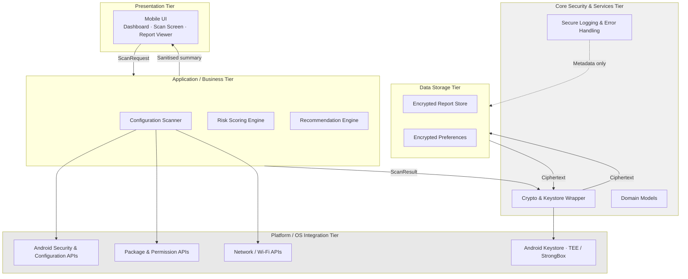

# System Architecture

**Mobile Security Configuration Evaluator (MSCE)**
Secure architecture design for an Android device-posture evaluation application.

---

## 1. Purpose and Scope

MSCE inspects security-relevant configuration on the Android device it runs on, evaluates that configuration against a rule set, and presents the user with a risk summary and concrete remediation steps.

**In scope:** reading device configuration state, evaluating it, scoring it, storing historical results locally, and presenting sanitised results.

**Out of scope:** modifying device settings, accessing user content (messages, photos, contacts, documents), network transmission of any kind, and any form of remote reporting or telemetry.

The out-of-scope list is a design constraint, not a disclaimer. Each exclusion removes an entire class of threat: no write capability means no privilege-escalation-through-the-tool vector; no network means no exfiltration channel and no server-side attack surface; no content access means a compromise of the app yields configuration metadata rather than user data.

---

## 2. Design Goals and Constraints

| ID | Goal | Rationale |
|---|---|---|
| G1 | All processing occurs on-device | The application handles a catalogue of a device's security weaknesses. Transmitting that anywhere creates a target of far greater value than the application itself. |
| G2 | Read-only operation | Eliminates the risk of the tool itself being abused to weaken a device. |
| G3 | Minimum necessary permissions | Every permission requested is an attack surface and a user-trust cost. |
| G4 | Findings encrypted at rest | Stored history is a reconnaissance asset; see Threat Model §3. |
| G5 | Graceful degradation | A check that cannot run must be reported as unavailable, never silently omitted or assumed passing. |
| G6 | Sanitised presentation | Raw configuration detail is not surfaced to the UI layer or to exported reports. |

**Platform constraint:** Android API 23 (6.0) minimum. The runtime permission model, hardware-backed Keystore availability, and several configuration APIs assume API 23 or later. Behaviour differences across API 26, 29, 30 and 31 materially affect what can be inspected — analysed in §7.

---

## 3. Architectural Style and Rationale

The system uses a **five-tier layered architecture**.

The choice is driven by a property specific to this application: it reads highly sensitive data, but most of the system does not need to see it. A scanner must handle raw configuration snapshots. A scoring engine needs only categorised findings. The UI needs only a summary. Layering allows each concern to be written, reviewed, and tested against a narrow, well-defined input — which is what makes a security review of the design tractable at all.

Two clarifications matter, because layered architectures are frequently over-claimed in security terms:

- Layering here delivers **separation of concerns, auditability, and reduced accidental exposure**. It does not, on its own, deliver privilege separation. §6 addresses this directly.
- Layering is a **design-time** control. It constrains what the code is written to do, not what an attacker who controls the process can do.

---

## 4. Architecture Diagram



**Note on scope:** there is no backend service, no rule-update endpoint, and no network egress of any kind in this design. The evaluation rule set is embedded in the application binary and changes only through a signed application update via the platform's normal distribution channel. This is a deliberate decision, not an omission — a remote rule-update channel would introduce an external trust boundary, a supply-chain dependency, and a tampering vector for the exact logic that determines whether a user is told their device is safe.

---

## 5. Tier Descriptions

### 5.1 Presentation Tier

**Role:** All user interaction and result visualisation.

**Responsibilities**
- Display overall posture, per-category risk, last scan time, and scan history
- Initiate scans and show progress, including partial results
- Present findings and recommendations in non-technical language
- Clearly mark checks that could not be performed, with the reason

**Design rationale**
- Holds no reference to OS configuration APIs, raw snapshots, or key material
- Consumes only `ScanSummary` objects, which are structurally incapable of carrying raw configuration values
- Marking unavailable checks visibly is a security requirement, not a usability nicety — see §8.2

### 5.2 Application / Business Tier

**Role:** Core evaluation logic.

**Configuration Scanner**
- Collects security-relevant state: lock-screen configuration, developer options and ADB state, OS version and security patch level, installation-source permissions, storage encryption status, and network posture where permitted
- Executes asynchronously; the UI thread is never blocked
- Returns a per-check result of `Pass`, `Fail`, `Warning`, or `Unavailable`, the last carrying a machine-readable reason code

**Risk Scoring Engine**
- Converts checks into per-category scores and an overall risk level
- Uses a deterministic, embedded, rule-based model — no heuristics, no remote input
- **Excludes `Unavailable` checks from scoring entirely** rather than treating them as passes; the resulting score is reported alongside a coverage ratio

**Recommendation Engine**
- Maps each finding to a specific, actionable instruction ("Enable a screen lock", "Review apps permitted to install unknown apps")
- Produces a `RecommendationSet` containing no raw configuration data

**Design rationale**
- This is the only tier that touches raw configuration state, keeping that exposure narrow and reviewable
- Deterministic logic is unit-testable, which means the threat model's assumptions about behaviour can be verified rather than asserted

### 5.3 Core Security & Services Tier

**Role:** Shared cryptographic and cross-cutting services.

**Crypto & Keystore Wrapper**
- Generates and uses AES-256-GCM keys held in the Android Keystore, hardware-backed where the device provides a TEE or StrongBox
- Keys are generated with `setUserAuthenticationRequired` where appropriate and are non-exportable by construction
- Key lifecycle: created on first use; destroyed when the application is uninstalled or its data cleared, at which point existing ciphertext becomes permanently unrecoverable

**Secure Logging & Error Handling**
- Records diagnostic metadata only — check identifiers, reason codes, timings
- Never records configuration values, package names, or network identifiers
- Centralises failure handling so that a single failed check degrades to `Unavailable` rather than aborting the scan

**Domain Models**
- `ConfigurationSnapshot`, `CheckResult`, `ScanResult`, `RiskScore`, `RecommendationSet`, `ScanSummary`, `StoredReport`
- Versioned, so the stored schema can evolve without invalidating historical reports
- The distinction between `ScanResult` (internal, raw) and `ScanSummary` (external, sanitised) is enforced by the type system, not by convention

### 5.4 Data Storage Tier

**Role:** Local persistence.

**Encrypted Report Store** — historical scan summaries, risk levels, timestamps, and categorised findings, encrypted at rest under Keystore-backed keys.

**Encrypted Preferences** — UI settings and consent flags. These are low-sensitivity individually but are encrypted anyway, because preference data can support inference about usage patterns.

**Design rationale**
- Storage is local and encrypted; nothing is transmitted
- Reports persist until the user deletes them or the application is removed
- Auto Backup is explicitly disabled for encrypted stores: restoring ciphertext to a device whose Keystore no longer holds the key produces unrecoverable data and runtime failures

**Implementation currency note:** the `androidx.security:security-crypto` library (`EncryptedSharedPreferences`, `EncryptedFile`) was deprecated at version 1.1.0-alpha07 in April 2025 with no direct official replacement. A current implementation should use Tink with Jetpack DataStore, or a maintained community fork, rather than the deprecated Jetpack Security Crypto APIs. The architecture is unaffected — the Crypto Wrapper exists precisely so that this dependency is swappable behind a stable interface.

### 5.5 Platform / OS Integration Tier

**Role:** The Android operating system and its security services.

**Provides**
- Configuration and settings APIs, subject to the restrictions analysed in §7
- Package and permission inspection APIs
- Network and Wi-Fi posture APIs
- The Android Keystore and, where available, TEE or StrongBox key isolation
- The application sandbox and permission enforcement

**Design rationale**
- This tier is trusted platform infrastructure, not application code
- It contains the only two boundaries in the system that are actually enforced against a hostile process — see §6

---

## 6. Security Boundaries: Enforced Versus Logical

This section exists because it is the most commonly overstated claim in layered mobile architecture documents.

### 6.1 The overstatement

It is routinely claimed that layering enforces least privilege between tiers, and that a compromise contained in one layer leaves the others protecting the user. **On Android this is not true for tiers within a single application.**

All five tiers execute in one process, under one Linux UID, inside one sandbox, holding one set of granted permissions. An attacker achieving code execution in the process — through a malicious library, a runtime instrumentation framework such as Frida, or an exploited parsing path — holds the Presentation Tier, the Crypto Wrapper, and every live Keystore handle simultaneously. There is no privilege drop between tier one and tier three, because there is no privilege difference to drop.

### 6.2 What is actually enforced

| Boundary | Enforced by | Holds against |
|---|---|---|
| Application sandbox | Linux UID isolation, SELinux policy | Other applications on the device |
| Keystore / TEE boundary | Hardware-backed key isolation | Key *extraction*, even by a process that can *use* the keys |
| Permission model | Android framework | Access to data the user has not granted |

The Keystore boundary deserves precision. Hardware-backed keys cannot be exported from the TEE. But a compromised process can still *invoke* those keys to decrypt data for as long as it runs. Hardware backing protects key material, not the plaintext that flows through the application.

### 6.3 What the layering does deliver

Stated accurately, the architecture provides:

- **Auditability** — cryptographic operations exist in one reviewable component rather than scattered across the codebase
- **Reduced accidental exposure** — the type-level separation of `ScanResult` from `ScanSummary` makes leaking raw configuration into the UI or an exported report a compile-time error rather than a code-review oversight
- **Blast-radius reduction for non-adversarial failure** — a malformed API response degrades one check instead of corrupting the scan
- **A reviewable attack surface** — a small number of components touch sensitive data, so a security review has a defined target

These are real, valuable properties. They are properties of *maintainability and correctness under fault*, not of *privilege isolation under attack*, and the distinction is stated here rather than blurred.

---

## 7. Platform Feasibility Analysis

A device-posture scanner's specification tends to be written from an intuition about what Android "should" allow. Several of those intuitions have been invalidated by platform hardening. Specifying checks that cannot be implemented is a documentation failure; specifying them and then silently not implementing them is a security failure, because the resulting score misrepresents coverage.

| Check | Mechanism | Constraint | Design decision |
|---|---|---|---|
| Security patch level | `Build.VERSION.SECURITY_PATCH` | None. Available from API 23. | **Implement.** Reliable and permissionless. |
| OS version / API level | `Build.VERSION` | None. | **Implement.** |
| Screen lock configured | `KeyguardManager.isDeviceSecure()` | None. API 23+. | **Implement.** |
| Biometric enrolment | `BiometricManager.canAuthenticate()` | None. API 29+. | **Implement** with API guard; `Unavailable` below API 29. |
| Developer options enabled | `Settings.Global.DEVELOPMENT_SETTINGS_ENABLED` | Readable. | **Implement.** |
| USB debugging / ADB enabled | `Settings.Global.ADB_ENABLED` | Readable. | **Implement.** |
| Storage encryption | `DevicePolicyManager.getStorageEncryptionStatus()` | Effectively constant — file-based encryption is mandatory on devices launching with Android 10+. | **Implement, report as informational.** Presenting a universally-passing check as a security win is misleading. |
| Global "unknown sources" | `Settings.Secure.INSTALL_NON_MARKET_APPS` | **Removed as a meaningful signal in API 26.** The legacy value is now always 1. The model became per-application. | **Do not implement as specified.** Substitute the per-app model below. |
| Per-app install permission | `PackageManager.canRequestPackageInstalls()` | Reports **only the calling application's** own permission, not other apps'. | **Implement with an explicit scope caveat.** Cannot enumerate which other apps hold this permission without broad package visibility. |
| Installed app enumeration | `PackageManager` with `QUERY_ALL_PACKAGES` | **Restricted permission since API 30.** Google Play treats the installed-app inventory as personal and sensitive data; use requires that broad visibility be core user-facing functionality, plus a Permissions Declaration Form, with removal risk for non-compliance. | **Implement conditionally.** Arguably justifiable for this app's core purpose, but must be declared and justified. Degrade to `Unavailable` if not granted. |
| Dangerous permissions held by other apps | `PackageManager.getPackageInfo(GET_PERMISSIONS)` | Depends entirely on package visibility above. | **Conditional on the same gate.** |
| Wi-Fi security type | `WifiInfo.getCurrentSecurityType()` | API 31+, and requires location permission. | **Implement with API and permission guards;** `Unavailable` otherwise. |
| Active VPN | `ConnectivityManager` transport inspection | Available, coarse. | **Implement as informational.** |
| Root / integrity state | Filesystem and property heuristics | **Defeatable.** See §7.1. | **Implement as advisory only,** with a documented confidence limit. |

### 7.1 Root detection: a documented limitation

Root detection is frequently the highest-weighted check in tools of this class, and it is the least reliable one.

Client-side detection relies on observable artefacts — `su` binaries, known package names, build properties, mount state. Every one of these is suppressible. Systemless root with selective hiding, Zygisk-based masking modules, and hooking frameworks such as LSPosed/Shamiko are designed specifically to defeat exactly these heuristics, and are widely available to non-expert users.

The honest consequences for this design:

1. A negative result means "no root artefacts were observed", **not** "the device is not rooted". The UI must not imply the stronger claim.
2. On a genuinely rooted device where root is actively hidden, the evaluator's own results are untrustworthy — a privileged process can hook the scanner, alter findings, and read plaintext before encryption.
3. Attestation-based alternatives — the Play Integrity API, which uses hardware-backed device verification — raise the bar meaningfully but are not absolute, require Google Play Services, and introduce a dependency this otherwise fully-offline design does not have.

**Design position:** root detection is retained as a *user-advisory* control, explicitly labelled as best-effort. It is not treated as an enforcement mechanism, and no security property of the system is made conditional on it.

---

## 8. Data Handling

### 8.1 Data classification

| Class | Examples | Handling |
|---|---|---|
| Raw configuration | `ConfigurationSnapshot` | Memory-resident only, never persisted, never leaves the Business Tier, cleared after scoring |
| Derived findings | `ScanResult`, `RiskScore` | Encrypted before persistence |
| Sanitised output | `ScanSummary`, `RecommendationSet` | Safe for UI display and export |
| Diagnostic metadata | Reason codes, timings | Logged; contains no configuration values |

### 8.2 Scoring integrity and false assurance

Given §7, any real deployment will have checks it cannot perform on some devices. How that is handled is a security decision.

The failure mode to avoid is a tool that quietly skips unavailable checks and prints a confident score. A user shown "88/100 — Good" who does not know that installed-app inspection never ran has been actively misinformed, and may skip a manual review they would otherwise have performed. **A security tool that produces false assurance is worse than no tool**, because it substitutes for vigilance it has not earned.

Design response:

1. `Unavailable` is a first-class result, distinct from `Pass` and `Fail`
2. Unavailable checks are excluded from the score denominator, never scored as passes
3. Every score is presented with a **coverage ratio** (e.g. "9 of 13 checks performed")
4. The UI names each skipped check and the reason — OS version, permission denied, or platform restriction
5. Below a coverage threshold, the numeric score is suppressed entirely in favour of a qualitative result

### 8.3 Export

Exported reports contain only sanitised summary data. The export path writes through the Core Security Tier so that content encoding is applied centrally, preventing injection into the generated HTML or PDF, and file paths are validated before any write.

---

## 9. Request / Response Flow

The operational path for a device scan, showing where each control is applied.

### 9.1 Request

The user initiates a scan. The Presentation Tier constructs a `ScanRequest` and passes it to the Business Tier.

```json
{
  "scanId": "123e4567-e89b-12d3-a456-426614174000",
  "timestamp": "2026-03-14T14:05:00Z",
  "includeNetworkChecks": true
}
```

### 9.2 Processing

1. **Configuration Scanner** queries the Platform Tier for each check in the active rule set. Each returns `Pass`, `Fail`, `Warning`, or `Unavailable` with a reason code. Failures are contained per check.
2. **Risk Scoring Engine** categorises results, computes per-category and overall risk, and calculates the coverage ratio. Unavailable checks are excluded from the denominator.
3. **Recommendation Engine** maps findings to remediation instructions.
4. **Core Security Tier** encrypts the `ScanResult` under a Keystore-backed key and writes ciphertext to the Data Storage Tier.
5. A `ScanSummary` — a distinct type that cannot structurally carry raw configuration values — is returned to the Presentation Tier.
6. The in-memory `ConfigurationSnapshot` is cleared.

### 9.3 Response

```json
{
  "scanId": "123e4567-e89b-12d3-a456-426614174000",
  "overallRisk": "High",
  "coverage": { "performed": 9, "total": 13 },
  "categories": [
    {
      "name": "Device Settings",
      "riskLevel": "High",
      "findings": [
        "No screen lock configured",
        "USB debugging is enabled"
      ]
    },
    {
      "name": "Platform",
      "riskLevel": "Medium",
      "findings": [
        "Security patch level is more than 6 months old"
      ]
    }
  ],
  "unavailable": [
    {
      "check": "installed_app_permissions",
      "reason": "PACKAGE_VISIBILITY_NOT_GRANTED"
    },
    {
      "check": "wifi_security_type",
      "reason": "REQUIRES_API_31"
    }
  ],
  "recommendations": [
    "Enable a secure screen lock (PIN, password, or biometric).",
    "Disable USB debugging in Developer options.",
    "Install available system updates."
  ],
  "timestamp": "2026-03-14T14:05:15Z"
}
```

The response demonstrates the design's two central claims: the UI receives no raw configuration data, and coverage gaps are surfaced rather than concealed.

---

## 10. Design Evaluation

Assessed against the quality attributes most relevant to this system, with evidence rather than assertion.

**Security.** Sensitive data handling is confined to two tiers; the type system prevents raw configuration reaching output paths; keys are hardware-isolated where available. The enforced boundaries are the OS sandbox and Keystore (§6.2) — the layering supports review quality rather than providing privilege isolation, and is claimed only on that basis.

**Privacy.** No network capability exists in the design, so exfiltration has no channel to use. Permissions are minimised, and the single broad permission the design may require (package visibility) is identified, justified, and made degradable.

**Reliability.** Scanning is asynchronous and per-check failures are isolated, so partial results are produced rather than an aborted scan. Deterministic scoring makes behaviour reproducible and testable.

**Maintainability.** Tier responsibilities are disjoint. The crypto dependency is isolated behind the Wrapper interface — which is what allows the Jetpack Security deprecation (§5.4) to be addressed as a dependency swap rather than a re-architecture.

**Trade-offs accepted**

| Trade-off | Cost | Justification |
|---|---|---|
| Encryption of all stored data | Measurable latency on low-end devices | Stored findings are a reconnaissance asset; the cost is paid once per scan, not per interaction |
| No remote rule updates | Rule changes require an app update | Removes an external trust boundary and a tampering vector on the logic that determines user-facing safety verdicts |
| Excluding unavailable checks from scoring | Scores are less directly comparable across devices | Comparability is not worth manufacturing false assurance (§8.2) |
| Advisory-only root detection | Weaker claim than competing tools make | The stronger claim would not be true (§7.1) |

---

## 11. Known Limitations

1. **In-process tiering is not privilege isolation.** Stated explicitly in §6 rather than obscured.
2. **Coverage varies by device and OS version.** Inherent to the platform; mitigated by transparency, not eliminated.
3. **Root detection is defeatable,** and on a rooted device the evaluator's own integrity cannot be assured.
4. **No attestation.** Play Integrity would strengthen device-state confidence at the cost of a Google Play Services dependency and the offline property. The trade-off is documented, not resolved.
5. **Not validated against physical devices.** This is a design document. Feasibility claims in §7 derive from platform documentation and policy, and would require empirical verification across a device matrix before implementation.

---

## References

1. OWASP. *Mobile Application Security Verification Standard (MASVS) 2.0.* https://mas.owasp.org/MASVS/
2. OWASP. *Threat Modeling Process.* https://owasp.org/www-community/Threat_Modeling_Process
3. Android Developers. *Behavior changes: Android 8.0 (API 26)* — deprecation of `INSTALL_NON_MARKET_APPS`. https://developer.android.com/about/versions/oreo/android-8.0-changes
4. Android Developers. *Package visibility filtering on Android.* https://developer.android.com/training/package-visibility
5. Google Play Console Help. *Use of the broad package (app) visibility (QUERY_ALL_PACKAGES) permission.* https://support.google.com/googleplay/android-developer/answer/10158779
6. Android Developers. *Jetpack Security releases* — deprecation of `androidx.security:security-crypto`. https://developer.android.com/jetpack/androidx/releases/security
7. NIST. *SP 800-57: Recommendation for Key Management.*
