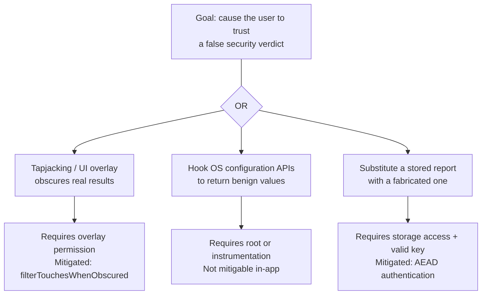
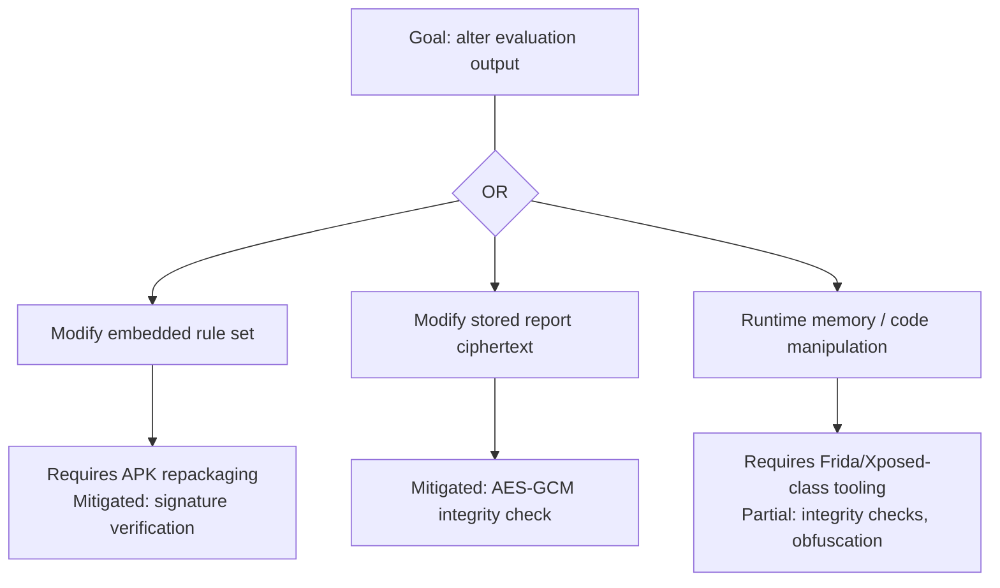
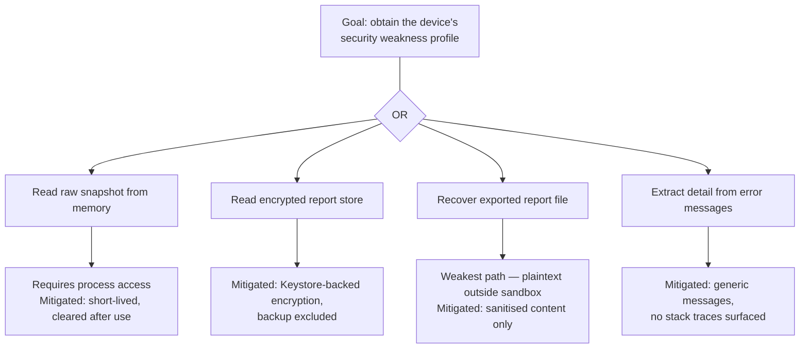
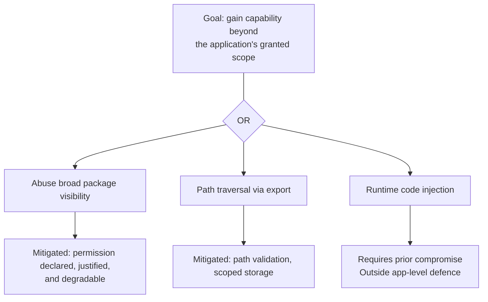

# Threat Model

**Mobile Security Configuration Evaluator (MSCE)**
STRIDE-based threat model following the OWASP threat modelling process.

---

## 1. Methodology and Scope

### 1.1 Approach

The analysis follows the OWASP threat modelling process, applied in four stages:

1. **Characterise the system** — establish what it does, what data it handles, and what it deliberately does not do
2. **Decompose it** — identify external entities, processes, data stores, entry points, exit points, and the trust boundaries between them
3. **Identify threats** — apply STRIDE at each trust boundary, and develop attack trees for the categories where multiple distinct paths exist
4. **Define and justify controls** — map mitigations to threats and to a recognised control standard

Decomposition precedes threat identification deliberately. Applying STRIDE to a system that has not been decomposed produces a checklist of generic threats; applying it to enumerated trust boundaries produces threats specific to this design. Every threat in §8 is anchored to a boundary from §7.

### 1.2 What the analysis concluded early

Two findings shaped the rest of the model and are stated here because they are not obvious from the application's description.

**The evaluator's stored output is more sensitive than any single configuration value it reads.** A live query of "is USB debugging on?" returns one bit. An accumulated report history is a dated catalogue of a specific device's weaknesses — precisely the reconnaissance an attacker would otherwise have to gather themselves. The Encrypted Report Store (A5) is therefore classified at the same criticality as the raw snapshot, and much of the control set exists to protect data the application itself produced.

**The tool's own integrity is a security property.** An evaluator that can be made to report "secure" is worse than no evaluator, because it suppresses user vigilance. Tampering threats against the scoring logic are treated as high severity for this reason, not because the code is confidential.

### 1.3 Scope

**Analysed:** the application, its local storage, its interaction with platform APIs, and the user-facing interface.

**Trusted:** the Android operating system, the platform sandbox, hardware-backed Keystore, and the OS APIs themselves. A compromised OS or a defeated TEE is outside this boundary — if the platform is subverted, no application-level control in this design holds.

**Not applicable:** server-side threats, transport security, and authentication against a remote service. The design has no network capability (see Architecture §4).

---

## 2. Trust Levels

| ID | Trust level | Description |
|---|---|---|
| **TL1** | Anonymous / unauthenticated | No access. Included for completeness: the application exposes no IPC surface, no exported components, and no network listener, so this level has no reachable interface. |
| **TL2** | Legitimate app user | The device owner. May start scans, view sanitised summaries and history, and export reports. Cannot access raw configuration data, ciphertext, or key material. |
| **TL3** | Application runtime (trusted app code) | Business logic performing scanning, scoring, and recommendation generation. Handles raw configuration data. Highest-sensitivity application-controlled code. |
| **TL4** | Core security services | Cryptographic operations, secure logging, and integrity handling. Invokes Keystore services on behalf of TL3. |
| **TL5** | Android OS / Keystore | Platform APIs, application sandbox, and hardware-backed key storage. Highest trust; enforces isolation that application code cannot. |
| **TLX** | External attacker / untrusted actor | Any party attempting unauthorised access to the application, its stored data, or its runtime behaviour. Not a trust level but an adversary class, listed here for reference throughout. |

**A necessary caveat.** TL3 and TL4 are *logical* designations describing intended data handling. They are not enforced privilege levels: both execute in one process under one UID. An adversary at TLX who achieves code execution holds TL3 and TL4 simultaneously. The distinction is retained because it is useful for reasoning about intended flows and for review, but no control in this model depends on TL3 being unable to do what TL4 does. See Architecture §6.

---

## 3. Asset Identification

### 3.1 Inventory

| ID | Asset | Description | Trust level |
|---|---|---|---|
| A1 | Configuration Snapshot | Raw device security configuration retrieved from platform APIs — lock screen state, developer options, permissions, network posture | TL3, sourced from TL5 |
| A2 | Raw Scan Results | Unprocessed findings before summarisation; reveal specific device weaknesses | TL3, protected by TL4 |
| A3 | Risk Scores | Computed per-category and overall risk values | TL3 |
| A4 | Recommendation Set | Remediation guidance derived from findings | TL2 (user-facing) |
| A5 | Encrypted Report Store | Historical evaluation data — findings, scores, timestamps. Accessible only via Keystore-backed keys | Managed by TL4, stored via TL5 |
| A6 | Encrypted Preferences | UI settings and consent flags | TL4 |
| A7 | Cryptographic Keys | Hardware-backed, non-exportable keys held in Keystore | TL5 |
| A8 | Crypto & Keystore Wrapper | Component performing all encryption and decryption and mediating Keystore access | TL4 |
| A9 | Secure Logging Metadata | Minimal diagnostic records containing no configuration values | TL4 |
| A10 | Domain Models | Internal type definitions governing data movement between tiers | TL3 |
| A11 | UI Display Data | Sanitised summaries intended for display; structurally cannot carry raw configuration | TL2 |
| A12 | Scanner / Scoring / Recommendation Logic | Core evaluation code; determines every verdict the user sees | TL3 |
| A13 | Platform Configuration APIs | OS interfaces providing security-relevant device state | TL5 |
| A14 | Android Keystore System | Hardware-protected key management subsystem | TL5 |
| A15 | OS Sandboxing Environment | Platform enforcement of permissions, storage isolation, and process separation | TL5 |

### 3.2 High criticality

Compromise directly undermines the security of the evaluator or the privacy of its user.

| Asset | Reason |
|---|---|
| A1 — Configuration Snapshot | Raw security state of the device. Disclosure hands an attacker a complete map of exploitable weaknesses. |
| A2 — Raw Scan Results | Unfiltered findings; equivalent exposure to A1 in derived form. |
| A5 — Encrypted Report Store | Accumulated history. Higher long-term value than any single snapshot, since it is dated, persistent, and comprehensive. |
| A7 — Cryptographic Keys | All confidentiality at rest depends on these. Compromise collapses A5 and A6 simultaneously. |
| A8 — Crypto & Keystore Wrapper | Mediates every cryptographic operation. Subversion is equivalent to key compromise for data in flight through it. |
| A12 — Scanner / Scoring Logic | Determines what the user is told. Tampering produces false assurance, which defeats the application's entire purpose. |

### 3.3 Medium criticality

| Asset | Reason |
|---|---|
| A3 — Risk Scores | Must be accurate to guide the user correctly, but disclose no raw configuration. Integrity matters more than confidentiality. |
| A4 — Recommendation Set | User-facing and non-sensitive, but manipulation could direct a user to weaken their device. |
| A6 — Encrypted Preferences | Low sensitivity individually; encrypted to prevent behavioural inference. |
| A9 — Secure Logging Metadata | Diagnostic only; must remain untampered to support failure analysis. |
| A10 — Domain Models | Structural integrity underpins correct sanitisation between tiers. |

### 3.4 Low criticality

Already exposed to the user by design, or protected by the platform rather than the application.

| Asset | Reason |
|---|---|
| A11 — UI Display Data | Sanitised by construction and intended for display. |
| A13 — Platform Configuration APIs | Trusted OS interfaces outside application control. |
| A14 — Android Keystore System | Hardware-backed platform subsystem. |
| A15 — OS Sandboxing Environment | Platform-provided isolation. |

---

## 4. System Decomposition

### 4.1 External entities

| ID | Entity | Role |
|---|---|---|
| E1 | User | Initiates scans, views results and history, exports reports |
| E2 | Android OS Security APIs | Supply device configuration attributes |
| E3 | Android Keystore | Performs cryptographic operations using hardware-backed keys |
| E4 | Android Storage Layer | OS-managed storage for encrypted reports and preferences |

There is no fifth external entity. The design has no backend service, no update endpoint, and no network egress — a deliberate choice that removes an entire trust boundary and its associated supply-chain and tampering threats.

### 4.2 Processes

| ID | Process | Role |
|---|---|---|
| P1 | UI Layer | User interaction, navigation, presentation of sanitised results |
| P2 | Application Runtime | Scan orchestration, configuration retrieval, risk scoring, recommendation generation |
| P3 | Core Security Services | Encryption, decryption, secure logging, error containment, Keystore mediation |

### 4.3 Data stores

| ID | Store | Contents |
|---|---|---|
| D1 | Encrypted Report Store | Past scan summaries as ciphertext; decryptable only via P3 |
| D2 | Encrypted Preferences Store | UI settings and consent flags in encrypted form |

---

## 5. Entry Points

Interfaces where data enters the system or a trust boundary is crossed inbound.

| ID | Entry point | Description | Trust levels |
|---|---|---|---|
| 0 | Application initialisation | Loads encrypted preferences, initialises cryptographic services, prepares runtime components. Corrupted local state can influence startup. | TL3, TL4 |
| 1 | UI interaction layer | Primary point where user actions enter the system and are forwarded to trusted logic. | TL2 → TL3 |
| 1.1 | Start scan action | User initiates a configuration scan. Transition from untrusted input to scanning logic. | TL2 → TL3 |
| 1.2 | View history action | User requests stored reports. Triggers decryption and load. | TL2 → TL3 → TL4 |
| 1.3 | View report details | User selects a specific report. Loads, decrypts, sanitises, displays. | TL2 → TL3 → TL4 |
| 1.4 | Preferences interaction | User modifies settings or feature toggles. Enters secure preference processing. | TL2 → TL3 |
| 2 | Android permission responses | OS grant/deny outcomes for requested permissions; influence runtime behaviour and available checks. | TL5 → TL3 |
| 2.1 | OS security API call | Runtime requests configuration data — lock screen, developer mode, network state, permissions. | TL3 → TL5 |
| 2.2 | OS configuration response | OS returns the configuration snapshot. **Sensitive device data enters the application here.** | TL5 → TL3 |
| 2.3 | Keystore crypto request | Application requests encryption or decryption from the Keystore. | TL4 → TL5 |
| 3 | Storage layer API | Runtime interacts with OS-managed storage to load or save encrypted data. | TL3, TL4 → TL5 |
| 3.1 | Encrypted report read | Loads report ciphertext from storage for decryption. **Untrusted-at-rest data re-enters the process here.** | TL5 → TL4 |
| 3.2 | Encrypted preferences read | Loads encrypted preference values via OS storage APIs. | TL5 → TL4 |

Entry points 2.2 and 3.1 deserve emphasis. Both bring data across a boundary into trusted logic: 2.2 introduces the most sensitive data the application ever handles, and 3.1 introduces data that may have been modified while at rest. Neither can be assumed well-formed.

---

## 6. Exit Points

Interfaces where data leaves the application and becomes visible, stored, or logged.

| ID | Exit point | Description | Trust levels |
|---|---|---|---|
| 1 | UI display layer | Primary exit; processed and sanitised output shown to the user. | TL2 |
| 1.1 | Risk summary output | Overall and per-category risk. Must not carry raw configuration values. | TL2 |
| 1.2 | Recommendation output | User-facing remediation guidance derived from findings. | TL2 |
| 1.3 | Report summary output | Sanitised historical report contents after decryption. | TL2, TL3 |
| 2 | File system write | Encrypted data written through OS storage APIs; leaves runtime for persistence. | TL3, TL4 → TL5 |
| 2.1 | Encrypted report write | Stores encrypted scan summaries locally. | TL3, TL4 |
| 2.2 | Encrypted preferences write | Stores encrypted UI and application preferences. | TL3, TL4 |
| 2.3 | Report export | User-initiated export to HTML or PDF. **Leaves the application's protection entirely.** Sanitised content, encoded output, validated destination path. | TL3 → TL2 |
| 3 | Secure log output | Metadata-only diagnostic records. | TL4 |
| 3.1 | Diagnostic log output | Non-sensitive debug and status information. | TL4 |

Exit point 2.3 is the weakest link in the confidentiality model and is identified as such. Once a report is exported to shared storage it is a plaintext file outside the application sandbox, readable by any process with storage access. The control is to restrict export content to sanitised summaries — accepting that the file is unprotected rather than pretending otherwise.

---

## 7. Trust Boundaries

| ID | Boundary | Description | Crossing | Enforced? |
|---|---|---|---|---|
| **TB1** | User → UI | Separates the untrusted user from the presentation layer. All user input originates here. | TL2 → TL3 | Logical |
| **TB2** | UI → Application Runtime | User-triggered actions cross from interface into business logic. | TL2 → TL3 | Logical |
| **TB3** | Application Runtime → Core Security | Runtime requests cryptographic or integrity operations. Only validated data should reach this layer. | TL3 → TL4 | Logical |
| **TB4** | Core Security → Android Keystore | Cryptographic operations performed by hardware-backed Keystore. Key material never leaves the OS trust zone. | TL4 → TL5 | **Enforced (hardware)** |
| **TB5** | Application Runtime ↔ OS Security APIs | Runtime requests device configuration; sensitive data enters the application. | TL3 ↔ TL5 | **Enforced (permissions)** |
| **TB6** | Application Runtime → File System | Encrypted reports and preferences pass to OS-controlled persistent storage. Data beyond this point is external and must be encrypted. | TL3 → TL5 | **Enforced (sandbox)** |
| **TB7** | Storage → Core Security (decryption path) | Ciphertext re-enters the application and is decrypted. Tampered or corrupted data must be handled safely. | TL5 → TL4 | **Enforced (sandbox)** |
| **TB8** | Application Runtime → UI output | Sanitised results return to the interface. Raw configuration must never cross outward. | TL3 → TL2 | Logical (type-enforced) |

**Reading this table.** The `Enforced?` column is the analytical contribution. TB4 through TB7 are backed by platform mechanisms — hardware key isolation, the permission model, UID-based sandboxing — and hold against a hostile process on the device. TB1, TB2, TB3 and TB8 are logical: they describe intended data flow within a single process and are meaningful for design review and accidental-exposure prevention, but do not hold against an adversary executing code inside that process. TB8 is strengthened relative to the other logical boundaries by type-level separation of `ScanResult` from `ScanSummary`, which converts a class of leak from a review oversight into a compile error — a development-time control, not a runtime one.

Distinguishing these two categories is what allows the control set in §10 to be honest about what it does and does not defend against.

---

## 8. STRIDE Analysis

Applied per trust boundary. Each threat is identified with the boundary it crosses and the asset it targets.

### 8.1 TB1 / TB2 — User → UI → Application Runtime

| Category | Threat | Target | Assessment |
|---|---|---|---|
| **S**poofing | Overlay or tapjacking attack presents a fake interface to capture interaction or mislead the user about results | A11 | Plausible. No credential exists to steal, but a spoofed "device secure" verdict is itself the harm. Mitigated by `filterTouchesWhenObscured` and `FLAG_SECURE`. |
| **T**ampering | User manipulates device settings mid-scan to alter the snapshot | A1 | Low impact. The user is the device owner; they may legitimately change settings. Mitigated by snapshot atomicity and timestamping. |
| **R**epudiation | User deletes reports or history | A5 | Accepted. The user owns their data and deleting it is a legitimate action, not an attack. No non-repudiation requirement exists for a single-user local tool. |
| **I**nformation disclosure | UI displays more detail than intended; screenshots or recents-screen capture expose findings | A11 | Real. Mitigated by sanitised display types and `FLAG_SECURE` on result screens. |
| **D**enial of service | Repeated scan triggering exhausts resources | A12 | Low. Mitigated by scan debouncing and single-scan-at-a-time enforcement. |
| **E**levation of privilege | User action escalates beyond intended capability | — | Not applicable. The user already holds the highest application-level privilege; the app grants no elevated capability to escalate toward. |

### 8.2 TB5 — Application Runtime ↔ OS Security APIs

| Category | Threat | Target | Assessment |
|---|---|---|---|
| **S**poofing | On a compromised or rooted device, hooked APIs return fabricated configuration values | A1, A13 | **High.** The application cannot verify authenticity of OS responses. Fundamental limitation, documented rather than mitigated — see §11. |
| **T**ampering | Instrumentation frameworks intercept and modify API responses in transit | A1 | **High.** Same root cause. Frida/Xposed-class tooling can rewrite return values. |
| **R**epudiation | No audit trail linking a configuration value to the moment it was read | A9 | Low. Mitigated by timestamping snapshots. |
| **I**nformation disclosure | Sensitive configuration data enters the process and is mishandled thereafter | A1 | Mitigated by memory-resident-only handling and clearing after scoring. |
| **D**enial of service | Malformed or unexpected API responses cause parsing failure and abort the scan | A12 | Mitigated by per-check failure isolation — one failed check degrades to `Unavailable`. |
| **E**levation of privilege | Application requests broader permissions than necessary, expanding its own attack surface | A15 | Mitigated by permission minimisation and conditional degradation (Architecture §7). |

### 8.3 TB6 / TB7 — Runtime ↔ Storage

| Category | Threat | Target | Assessment |
|---|---|---|---|
| **S**poofing | Attacker substitutes a report file with a fabricated one | A5 | Mitigated by AEAD (AES-GCM): a substituted or forged blob fails authentication and is rejected. |
| **T**ampering | Stored ciphertext is modified in place | A5, A6 | Mitigated by AEAD integrity verification. Detection, not prevention — modified data is rejected rather than silently accepted. |
| **R**epudiation | Deletion of stored reports leaves no trace | A5, A9 | Accepted, as §8.1. |
| **I**nformation disclosure | Report history read from storage, including via device backup | A5 | Mitigated by encryption at rest with Keystore-backed keys, and by explicit exclusion from Auto Backup. On a rooted device, a privileged process can still invoke the app's keys — see §11. |
| **D**enial of service | Storage exhausted by unbounded report accumulation | A5 | Mitigated by report retention limits and size caps. |
| **E**levation of privilege | Path traversal during export writes outside the intended location | — | Mitigated by path validation and use of scoped storage APIs. |

### 8.4 TB3 / TB4 / TB8 — Internal and Keystore boundaries

| Category | Threat | Target | Assessment |
|---|---|---|---|
| **S**poofing | Malicious component impersonates the Crypto Wrapper | A8 | Not defensible in-process (§2 caveat). The real boundary is TB4: hardware prevents key *extraction* regardless. |
| **T**ampering | Runtime code injection alters scoring logic so the tool reports a false verdict | A12 | **High.** The application's core purpose is defeated. Partially mitigated by integrity checks and obfuscation; fully mitigated only by attestation, which this design does not use. |
| **R**epudiation | Cryptographic operations are unlogged | A9 | Mitigated by metadata-only secure logging. |
| **I**nformation disclosure | Raw configuration data leaks into UI output or exported reports | A1, A11 | Mitigated by type-level separation (TB8) — a leak requires a type violation, not merely an oversight. |
| **D**enial of service | Key unavailability (e.g. after biometric enrolment change invalidates a key) renders all history unreadable | A5, A7 | Mitigated by graceful handling of `KeyPermanentlyInvalidatedException` and the ability to re-scan; historical data loss is accepted as the cost of key binding. |
| **E**levation of privilege | Process compromise yields use of Keystore handles | A7 | Keys cannot be extracted (hardware-enforced), but can be *used* while the process runs. Documented limitation, §11. |

---

## 9. Attack Trees

Developed for the categories where multiple materially distinct attack paths exist.

### 9.1 Spoofing

### 9.2 Tampering

### 9.3 Information Disclosure

### 9.4 Elevation of Privilege

Repudiation and Denial of Service are not modelled as trees. Both have single-path realisations in this system — deletion of local data the user owns, and resource exhaustion through repeated scanning — and a tree would add no analytical value.

---

## 10. Security Controls and MASVS Mapping

Controls mapped to OWASP MASVS 2.0 control groups, with the threats each addresses.

| # | Control | MASVS group | Threats addressed |
|---|---|---|---|
| C1 | Least-privilege permission model; conditional degradation when permissions are unavailable | MASVS-PLATFORM, MASVS-PRIVACY | TB5 elevation of privilege; reduces baseline attack surface |
| C2 | Input validation at TB1/TB2 and on all data re-entering from storage (TB7) | MASVS-PLATFORM, MASVS-CODE | TB7 tampering; malformed-data denial of service |
| C3 | Output encoding on exported HTML and PDF reports | MASVS-CODE | Injection via exported artefacts |
| C4 | AES-256-GCM encryption at rest under hardware-backed Keystore keys | MASVS-STORAGE, MASVS-CRYPTO | TB6/TB7 information disclosure and tampering |
| C5 | Explicit exclusion of encrypted stores from Auto Backup | MASVS-STORAGE | Disclosure via device backup; restore-time key mismatch |
| C6 | Secure error handling — generic user messages, no stack traces or internal detail surfaced | MASVS-CODE | Information disclosure via error paths |
| C7 | Metadata-only logging; no configuration values, package names, or network identifiers recorded | MASVS-STORAGE, MASVS-PRIVACY | Disclosure via log inspection |
| C8 | Type-level separation of `ScanResult` from `ScanSummary` | MASVS-CODE, MASVS-PRIVACY | TB8 information disclosure |
| C9 | Per-check failure isolation and re-scan capability | MASVS-PLATFORM | Denial of service; availability of results |
| C10 | Root and integrity detection, **advisory only** | MASVS-RESILIENCE | TB5 spoofing and tampering — partial, see §11 |
| C11 | `FLAG_SECURE` on result screens; `filterTouchesWhenObscured` on interactive controls | MASVS-PLATFORM | TB1 spoofing and overlay disclosure |
| C12 | Coverage reporting and exclusion of unavailable checks from scoring | MASVS-PRIVACY (transparency) | False assurance — see Architecture §8.2 |

**On C10 and MASVS-RESILIENCE.** MASVS-RESILIENCE controls raise the cost of attack against a determined adversary who controls the device; they do not prevent it. The mapping is included because the control belongs to that group, not to claim the group's objectives are met. C10's limitations are stated in §11 and in Architecture §7.1.

---

## 11. Limitations of This Model

Stated explicitly, because a threat model that omits its own boundaries is itself a source of false assurance.

**1. In-process trust levels are not enforced.** TL3 and TL4, and boundaries TB1, TB2, TB3 and TB8, are logical distinctions within a single process. An adversary with code execution in that process holds all of them. Controls dependent on these boundaries defend against accidental exposure and design error, not against an active in-process attacker.

**2. The application cannot verify the platform beneath it.** Every configuration value originates from an OS API. If those APIs are hooked — by root-level tooling or a runtime instrumentation framework — the evaluator faithfully reports fabricated data. There is no application-level defence against this. Attestation via the Play Integrity API would raise the cost, at the price of a Google Play Services dependency and the loss of fully-offline operation.

**3. Root detection is defeatable.** Systemless root with selective hiding and hooking frameworks are designed specifically to defeat the heuristics C10 relies on, and are available to non-expert users. A negative result means no artefacts were observed, not that the device is unmodified.

**4. Keys can be used, if not extracted.** Hardware backing prevents key material leaving the TEE. It does not prevent a compromised process from invoking those keys to decrypt data while it runs. Hardware backing protects keys, not plaintext.

**5. Exported reports leave all protection.** Once written to shared storage, an exported report is a plaintext file readable by any process with storage access. Restricting export content to sanitised summaries limits the damage; it does not protect the file.

**6. STRIDE is a coverage heuristic, not a proof.** It structures the search for threats and reduces the chance of missing a category. It does not guarantee completeness, particularly for composite attacks chaining several low-severity weaknesses.

**7. Risk prioritisation is not included here.** This document identifies and classifies threats. Quantitative prioritisation — whether by DREAD, CVSS, or the OWASP Risk Rating methodology — is deliberately out of scope. It is worth noting that DREAD, the traditional companion to STRIDE, was abandoned by its originators at Microsoft over concerns about scoring subjectivity and inconsistency between assessors; any prioritisation exercise built on it would need per-score justification to be reproducible.

**8. Not empirically validated.** This is a design-stage model. Its assumptions about platform behaviour derive from documentation and policy, and would require verification against a physical device matrix before implementation.

---

## References

1. OWASP. *Threat Modeling Process.* https://owasp.org/www-community/Threat_Modeling_Process
2. OWASP. *Mobile Application Security Verification Standard (MASVS) 2.0.* https://mas.owasp.org/MASVS/
3. OWASP. *Mobile Application Security Testing Guide (MASTG).* https://mas.owasp.org/MASTG/
4. Shostack, A. *Threat Modeling: Designing for Security.* Wiley, 2014.
5. Microsoft. *The STRIDE Threat Model.* Microsoft Learn.
6. Android Developers. *Android Keystore system.* https://developer.android.com/privacy-and-security/keystore
7. Android Developers. *Package visibility filtering on Android.* https://developer.android.com/training/package-visibility
8. Google Play Console Help. *Use of the broad package (app) visibility (QUERY_ALL_PACKAGES) permission.* https://support.google.com/googleplay/android-developer/answer/10158779
9. NIST. *SP 800-57: Recommendation for Key Management.*
